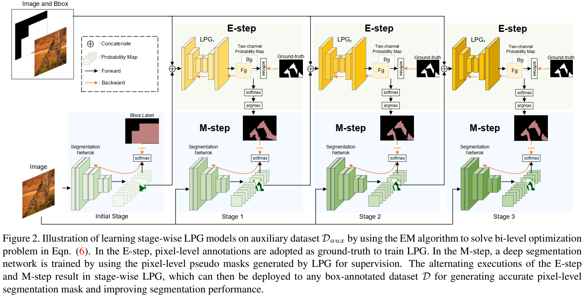

# LPG_BBox_Segmentation

## Introduction
This is the code for Paper: Learning Class-Agnostic Pseudo Mask Generation for Box-Supervised Semantic Segmentation [Paper](https://arxiv.org/abs/2103.05463). In this paper, we aim at seeking for a more accurate learning-based class-agnostic pseudo mask generator tailored to box-supervised semantic segmentation.


## Prerequisites
- Python 3.6
- Pytorch >= 1.2 (tested on Pytorch version 1.2.0, 1.6.0)
- CPU or NVIDIA GPU + Cuda + Cudnn

## Instructions

### Pretrained Models And Pseudo Masks
Pretrained models and the generated pseudo labels can be found at [Google Drive](https://drive.google.com/drive/folders/1AWz7Y_h7CnUFeHjZqTBWxp1kns-4OR4P?usp=sharing) or [Baidu Cloud](https://pan.baidu.com/s/1QPALYwdjWkoTm8t5JiCt5Q) (extract code: 4aai).

### Data Preparation

Download [PASCAL VOC 2012](http://host.robots.ox.ac.uk/pascal/VOC/voc2012/index.html) dataset and extract the training images to $your_voc_root/JPEGImages and the annotations under $your_voc_root/Annotations. We suggest that you use the train_aug dataset (with 10582 training images). Download [MS-COCO](https://cocodataset.org/#home) dataset and extract the training images to $your_coco_root/train2017, and then put mask annotation file (instances_train2017.json) under $your_coco_root/annotations. Run the following script for generating COCO (60 classes) labels for training LPG models: 

```
python utils/parseCOCO.py --dataRoot $your_coco_root
```

This script will generate gt labels of COCO(60 classes) under $your_coco_root/train2017_seg60 and Bbox labels of COCO(60 classes) under $your_coco_root/train2017_bbox60. 


### Generate Pseudo Labels for PASCAL VOC 2012
Download the pretrained LPG models from the given link and put them under "PretrainedModel/LPG/", then run following script to generate pseudo labels for training segmentation backbone. 

```
python genPseudoMasks.py --dataset voc --round (1|2|3)  --model_path_test ./PretrainedModel/LPG/(LPG_Round1.pth | LPG_Round2.pth | LPG_Round3.pth) --voc_proposals_dir $yourPathToSavePseudoLabels --model_type (vgg16 | resnet101) --init_voc_model_path $yourPretrained_segemenation_backbone
```

Note: The number of round should be the same to the corresponding LPG model. For example, if you choose the generate pseudo labels on round 2 using ResNet101 backbone, then set "--round 2 --model_path_test ./PretrainedModel/LPG/LPG_Round2.pth ----init_voc_model_path ./PretrainedModel/LPG/ResNet101/DeeplabV2Resnet101_VOC_Round1.pth". Here, the round of segmentaion backbone should be 1 less than the LPG, because the LPG model is trained to refine the rough predictions of the segmentation backbone trained on previous round.


### Testing Performance
To test the performance of the segmentation backbone trained with generated pseudo labels by LPG, run the following scripts:

```
python test.py --type test --root_path $your_voc_root --model_type (vgg16 | resnet101) --model_path $pretrainedModel
```

Then run crf post-processing:

```
python test.py --type crf --root_path $your_voc_root --model_type (vgg16 | resnet101) --n_jobs $numberOfWorkers
```

### Training Segmentation Backbone
Remember to put your generated pseudo masks $path_name_pseudo_masks under your VOC data root $your_voc_root.

To train DeepLabV1-LargeFOV-VGG16:

```
python main.py --root_path $your_voc_root --label_path_name $path_name_pseudo_masks --model_type vgg16 --init_model_path $initial_model --save_path $pathToSaveModels --cuda (True | False) --workers $numberOfWorkers
```

To train DeepLabV2-ResNet101:
```
python main.py --root_path $your_voc_root --label_path_name $path_name_pseudo_masks --model_type resnet101 --init_model_path $initial_model --save_path $pathToSaveModels --cuda (True | False) --workers $numberOfWorkers
```

### Train LPG Model
To train LPG models, run the following script:

```
python trainLPG.py --coco_root_dir $your_coco_root --init_seg_model_path $pathOfSegmentBackbone --init_lpg_model_path $pathOfPretrainedLPGModel (from previous training round)
```


### If you find this code would be useful
Please cite our paper

```
@article{Xie_LPG_seg,
author = {Chaohao Xie and Dongwei Ren and Lei Wang and Qinghua Hu and Liang Lin and Wangmeng Zuo},
title = {Learning Class-Agnostic Pseudo Mask Generation for Box-Supervised Semantic Segmentation},
journal = {arXiv preprint arXiv:2103.05463},
year = {2021},
}
```


### Acknowledgement
We benifit a lot from [kazuto1011/deeplab-pytorch](https://github.com/kazuto1011/deeplab-pytorch) and [wangleihitcs/DeepLab-V1-PyTorch](https://github.com/wangleihitcs/DeepLab-V1-PyTorch), thanks for their excellent work.